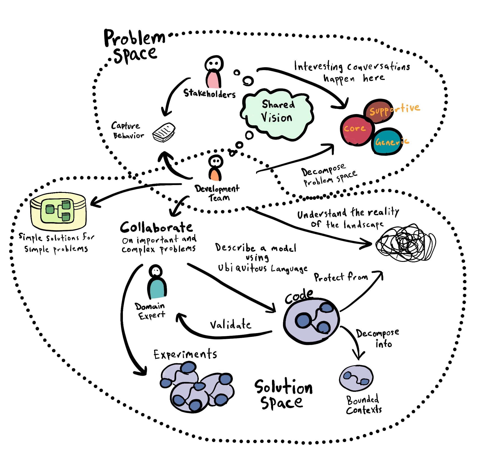

# The philosophy of Domain-Driven Design

Domain-Driven Design is a philosophy and approach to developing software, it's not an architecture. Strategic DDD helps us of getting out of the big ball of mud \(logical and not physical coupling\). It helps us in identifying our business capability boundaries \(**bounded context**\) using an **ubiquitous language** \(a language that is shared and understood in one part of the business\) as well identifying and naming the relationships \(**context mapping**\) that our bounded contexts \(also teams\) have between each other. By understanding the relationships between our contexts, it aids in making decisions about how are we going to model our software.

It’s a mindset: the application **Design** is **Driven** by the business **Domain**. There are no steps of how to do DDD and there isn’t a formula you can learn. What you can learn from Eric Evans or other DDD experts is how they approached a problem, but nobody can give you a sure recipe of how to do things.

*updates:* 
*14.05.2022: The highly desirable way of context communication is event-based*
 
*29.04.2022: Implementing Domain-Driven Design for Microservice Architecture (Ernese Norelus)*
 
*26.04.2022: Applying Domain-Driven Design and Patterns (Jimmy Nilsson)*
 
*11.04.2022: Patterns on Deriving APIs and their Endpoints from Domain Models*
 
*09.04.2022: The Art of Discovering Bounded Contexts by Nick Tune (YouTube)*
 
*22.03.2022: Added a subset of Dutch sites*
 
*27.02.2022: Gateway Interchange Context on YouTube - Nick Tune 2019*
 
*22.01.2022: What is Microservice Architecture - Kenneth Lange 2017*
 
*08.01.2022: The Bounded Context Canvas - DDD crew 2021*
 
*04.01.2022: Canonical Data Models - Gateway Interchange Contexts Nick Tune 2019*
 
*04.01.2022: Bounded Contexts and Canonical Data Models - Michael Plöd 2016*
 
*13.11.2021: Bounded contexts and subdomains - Robert Basic 2018*
 
*05.10.2021: Context Maps - a deep dive - Michael Plöd - KanDDDinsky 2019*
 
*28.09.2021: Strategies for getting started with DDD - Eric Evans 2013*
 
*26.09.2021: The repository cares about storing/retrieving objects from the db*

### Theory books and pdfs

* The canonical Big Blue Book of Eric Evans \(2003\): [Domain-Driven-Design Tackling Complexity in the Heart of Software](https://github.com/gg-daddy/ebooks/blob/master/Eric%20Evans%202003%20-%20Domain-Driven%20Design%20-%20Tackling%20Complexity%20in%20the%20Heart%20of%20Software.pdf)
* Domain Driven Design Quickly is a short, quick-readable summary and introduction to the fundamentals of DDD \(2006\): [Domain Driven Design Quickly](https://www.infoq.com/minibooks/domain-driven-design-quickly/)
* Strategies for getting started with DDD when you have a big commitment to legacy systems \(by Eric Evans 2013\): [Getting started with DDD when surrounded by legacy systems](https://www.domainlanguage.com/wp-content/uploads/2016/04/GettingStartedWithDDDWhenSurroundedByLegacySystemsV1.pdf)
* Domain-Driven Design, Definitions and Pattern Summaries \(by Eric Evans 2015\): [Domain-Driven Design Reference](https://www.domainlanguage.com/wp-content/uploads/2016/05/DDD_Reference_2015-03.pdf)
* Vaughn Vernon presents the whole of Domain-Driven Design \(by Vaughn Vernon 2013\): [Implementing Domain-Driven Design](https://ptgmedia.pearsoncmg.com/images/9780321834577/samplepages/0321834577.pdf)
* Concise basics of DDD \(by Vaughn Vernon 2016\): [Domain-Driven Design Distilled](https://github.com/phulei/books-1/blob/master/software-development/domain-driven-design-distilled.pdf)
* Patterns, Principles and Practices of Domain-Driven Design \(by Scott Millet and Nick Tune 2015\): [Patterns, Principles and Practices of Domain-Driven Design](https://sd.blackball.lv/library/patterns_principles_and_practices_of_domain-driven_design_(2015).pdf)
* The Anatomy of Domain Driven Design \(by Scott Millett 2019\): [Primer DDDEurope.com](https://www.elbandit.co.uk/images/DDDEU-Booklet.pdf)
* Applying Domain-Driven Design and Patterns: With Examples in C# and .NET \(by Jimmy Nilsson 2006\): [Applying Domain-Driven Design and Patterns](https://az.1lib.to/book/634707/522ff3)

___
### Great quotes 

* Quotes for Bounded Contexts \(2022\): [Quotes for the concept of Bounded Context](./boundedcontextquotes.md)
* Quotes for Ubiquitous Language \(2022\): [Quotes for the concept of Ubiquitous Language](./ubiquitouslanguagequotes.md)

___
### Theory links

* DDD easily explained \(by Anders Gill 2019\): [Part 1: Domain Driven Design like a pro](https://medium.com/raa-labs/part-1-domain-driven-design-like-a-pro-f9e78d081f10)
* A Decade of DDD, CQRS and Event Sourcing \(by Anes Hasičić 2019\): [A Decade of DDD, CQRS and Event Sourcing by Anes Hasičić](https://tacta.io/a-decade-of-ddd-cqrs-and-event-sourcing/)
* DDD introduction \(by Dan Haywood 2019\): [An Introduction to Domain Driven Design](https://www.methodsandtools.com/archive/archive.php?id=97)
* Various articles on Sapiens Works \(2012 - 2018\): [Sapiens Works: Domain Driven Design](https://blog.sapiensworks.com/tags.html#Domain%20driven%20design)
* Triple D Courses \(2019\): [DDD basic concepts](https://drive.google.com/file/d/1jFM0biU4YLY5OpUXTsC_bXv-hNbMbNKs/edit)
* Wikipedia \(2021\): [Domain-driven design](https://en.m.wikipedia.org/wiki/Domain-driven_design)

___
### DDD in practice

* This article shows a domain-driven approach to designing microservices \(by Microsoft 2019\): [Using domain analysis to model microservicess](https://docs.microsoft.com/en-us/azure/architecture/microservices/model/domain-analysis)

___
### Bounded Context

* What is Bounded Context? \(by Dave Taubler 2020\): [If You’re Building Microservices, You Need to Understand What a Bounded Context is](https://medium.datadriveninvestor.com/if-youre-building-microservices-you-need-to-understand-what-a-bounded-context-is-30cbe51d5085)
* BoundedContext \(by Martin Fowler 2014\): [Bounded Context is a central pattern in Domain-Driven Design](https://martinfowler.com/bliki/BoundedContext.html)
* The Bounded Context Canvas \(by DDD-crew Github 2021\): [A structured approach to designing and documenting each of your bounded contexts](https://github.com/ddd-crew/bounded-context-canvas)
* Clues for discovering Contexts \(by Nick Tune 2017\): [The Art of Discovering Bounded Contexts](https://www.youtube.com/watch?v=ez9GWESKG4I&t=700s)

___
### Bounded Contexts and Microservices

* Bounded Contexts are the exact opposite of Microservices! \(by Vladik Khononov 2018\): [Bounded Contexts are NOT Microservices](https://vladikk.com/2018/01/21/bounded-contexts-vs-microservices/)
* Design of microservices using the principles of Domain-Driven Design \(by IBM 2018\): [Apply Domain-Driven Design to microservices architecture](https://www.ibm.com/garage/method/practices/code/domain-driven-design/)
* SOA vs Microservices \(by Rahul Lanje 2017\): [What is Microservice Architecture? How is it different from SOA? Why containers?](https://www.linkedin.com/pulse/what-microservice-architecture-how-different-from-soa-rahul-lanje/)
* Ideally there should be a direct mapping between a business service / capability and a microservice (or what in Domain Driven Design is called a bounded context \(by Kenneth Lange 2017\): [What is Microservice Architecture?](https://www.linkedin.com/pulse/what-microservice-architecture-kenneth-lange/)
* Break a monolith into multiple domain-based microservices - as we break the monolith and spread the aggregates into different contexts... \(by Chandra Ramalingam 2020\): [Building Domain Driven Microservices](https://medium.com/walmartglobaltech/building-domain-driven-microservices-af688aa1b1b8)
* Thoughts on how to marriage Domain-Driven Design (DDD) with microservice architecture \(Ernese Norelus 2019\): [Implementing Domain-Driven Design for Microservice Architecture](https://medium.com/design-and-tech-co/implementing-domain-driven-design-for-microservice-architecture-26eb0333d72e)

___
### Bounded Contexts and Domain Models

* A domain model should omit the extraneous information irrelevant to its task. \(by Vladik Khononov 2020\): [Thread on models and bounded contexts](https://mobile.twitter.com/vladikk/status/1335947978482339841)

___
### Published language & Ubiquitous language

* But in order to make the API understandable to domain experts, it is essential that names and abstractions in the API follow the terms defined in the ubiqitous language which is formally specified by the domain model \(2021\): [Patterns on Deriving APIs and their Endpoints from Domain
Models
](https://eprints.cs.univie.ac.at/6948/1/europlop21-s16-camera-ready2.pdf)

___
### Bounded Contexts, Canonical Data Models and Interchange Contexts

* Bounded Contexts can have a unified model (a way of structuring MultipleCanonicalModels). \(by Martin Fowler 2014\): [MultipleCanonicalModels](https://martinfowler.com/bliki/BoundedContext.html)
* Implement the bounded context concept meaning one model per context. \(by Teiva Harsanyi 2017\): [Why is a Canonical Data Model an Anti Pattern](https://teivah.medium.com/why-is-a-canonical-data-model-an-anti-pattern-441b5c4cbff8)
* Lightweight Canonical Data Model per functional domain. \(by Tanya du Preez 2016\): [Canonical Data Models & Microservices](https://www2.deloitte.com/content/dam/Deloitte/za/Documents/strategy/ZA_Deloitte_Digita_Canonical_Schemas.pdf)
* Multiple smaller canonical models that sit within our bounded contexts - bounded context in API path. \(by Jeff Watkins 2018\): [Architectural Mistakes I Have Made: Microservices, APIs, Commoditisation and Bounded Contexts](https://www.linkedin.com/pulse/architectural-mistakes-i-have-made-microservices-apis-jeff-watkins)
* Microservices Domain Driven Design, why and how? (Published Language as pattern and Canonical Data Model). \(by Michael Plöd 2016\): [Published Language and Canonical Data Model](https://youtu.be/lUCLFOISuXk?t=1175)
* Gateway Interchange Contexts. \(by Nick Tune 2019\): [Gateway Interchange Context as Enterprise Integration Pattern](https://medium.com/nick-tune-tech-strategy-blog/gateway-interchange-contexts-899696e67848)
* Canonical Data Model Best practices. \(by Majeed 2018\): [For microservices, define a light weight canonical model per functional domain](https://github.com/sambos/Architectures/wiki/Canonical-Data-Model-Best-practices)
* Data Management at Scale. \(by O'Reilly Piethein Strengholt 2020\): [Enterprises took the “E” in ESB literally and implemented monoliths into their organization to take care of all the service integration](https://www.oreilly.com/library/view/data-management-at/9781492054771/ch04.html)
* Strategic Microservice Patterns. \(by Nick Tune 2019\): [Gateway Interchange Contexts on YouTube](https://www.youtube.com/watch?v=ZZXMMnV3EoU&t=1846s)

___
### Relationship Bounded Contexts and Subdomains

* The subtle relationship between bounded contexts and sub-domains \(by Lev Gorodinski 2013\): [Sub-domains and Bounded Contexts in Domain-Driven Design \(DDD\)](http://gorodinski.com/blog/2013/04/29/sub-domains-and-bounded-contexts-in-domain-driven-design-ddd/)
* Stackoverflow \(2018\): [Confused about Bounded Contexts and SubDomains](https://stackoverflow.com/questions/18625576/confused-about-bounded-contexts-and-subdomains)
* Stackoverflow \(2018\): [Can subdomain and bounded context be same in domain driven design?](https://stackoverflow.com/questions/32069892/can-subdomain-and-bounded-context-be-same-in-domain-driven-design)
* 'The optimal solution would be to have one bounded context in one subdomain' \(by Robert Basic 2018\): [Bounded contexts and subdomains](https://medium.com/nick-tune-tech-strategy-blog/gateway-interchange-contexts-899696e67848)
* Subdomain vs Bounded Context \(by Nick Tune 2020\): [Domain, Subdomain, Bounded Context, Problem/Solution Space in DDD: Clearly Defined](https://medium.com/nick-tune-tech-strategy-blog/domains-subdomain-problem-solution-space-in-ddd-clearly-defined-e0b49c7b586c)

___
### Context map: communication between Bounded Contexts

* Stackoverflow \(2013\): [Communicating between two Bounded Contexts in DDD](https://stackoverflow.com/questions/16713041/communicating-between-two-bounded-contexts-in-ddd)
* Stackoverflow \(2013\): [DDD - How to design associations between different bounded contexts](https://stackoverflow.com/questions/18761001/ddd-how-to-design-associations-between-different-bounded-contexts)
* Context Mapping \(by Vladik Khononov 2019\): [What Is Domain-Driven Design? O'Reilly](https://www.oreilly.com/library/view/what-is-domain-driven/9781492057802/ch04.html)
* Context Maps - a deep dive \(by Michael Plöd 2019\): [Context Maps - a deep dive - Michael Plöd - KanDDDinsky 2019](https://www.youtube.com/watch?v=VjtMt689ql8)

___
### Event Driven Architecture: preffered solution for communication between Bounded Contexts

* Stackoverflow \(2016\): [The highly desirable way of context communication is event-based](https://softwareengineering.stackexchange.com/questions/316819/how-to-clearly-define-boundaries-of-a-bounded-context)
* 'Use events as a way to communicate between bounded contexts'. \(by Indu Alagarsamy 2019\): [Practical DDD: Bounded Contexts + Events => Microservices](https://www.infoq.com/presentations/microservices-ddd-bounded-contexts/)

___
### Difference between Entities and Value Objects

* Entities versus Value Objects \(by Philip Brown 2014\): [What is the difference between Entities and Value Objects?](https://www.culttt.com/2014/04/30/difference-entities-value-objects/)
* Entity vs Value Object \(by Vladimir Khorikov 2016\): [Entity vs Value Object: the ultimate list of differences](https://enterprisecraftsmanship.com/posts/entity-vs-value-object-the-ultimate-list-of-differences/)

___
### Repositories

* The repository cares about storing/retrieving objects from the db \(2014\): [Repositories in domain driven design](https://stackoverflow.com/questions/23253092/repositories-in-domain-driven-design)

___
### Strategic and Tactical patterns

* Start with a strategy \(by Yoan Thirion 2018\): [DDD re-distilled This article is an abstract of the book DDD Distilled written by Vaughn Vernon](https://yoan-thirion.gitbook.io/knowledge-base/software-architecture/ddd-re-distilled#ddd-what)

___
### DDD concepts and REST equivalents

* API design - Azure Architecture \(2019\): [Designing APIs for microservices](https://docs.microsoft.com/nl-nl/azure/architecture/microservices/design/api-design)
* Aggregate Roots are a good starting point for API Resources \(Zimmerman ao 2021\): [A Grey Literature Study Based on Grounded Theory](https://zenodo.org/record/4493865/files/api_ddd_grey_literature_based_gt.pdf)

___
### DDD, microservices and Kafka

* Apache Kafka + Domain-driven design (DDD) = Decoupled event streaming microservices \(by Kai Waehner 2019\): [Microservices, Apache Kafka, and Domain-Driven Design](https://www.confluent.io/blog/microservices-apache-kafka-domain-driven-design/)

___
### Awesome Github.com sites

* kgoralski \(2019\): [Domain-driven design \(DDD\) learning resources](https://github.com/kgoralski/personal-wiki-and-learning-resources/blob/master/domain-driven-design.md)
* heynickc \(2021\): [Awesome Domain-Driven Design](https://github.com/heynickc/awesome-ddd)

___
### DDD slack community

* ddd-cqrs-es: [ddd-cqrs-es.slack.com](https://ddd-cqrs-es.slack.com/)

___
### ESB versus Microservices

* IBM \(2021\): [ESB vs. Microservices: What's the Difference?](https://www.ibm.com/cloud/blog/esb-vs-microservices)

___
### Dutch sites

* Trivento: [Hoe 'Bounded Contexts' helpen microservices af te bakenen](https://www.trivento.nl/blog/de-grenzen-van-microservices)

