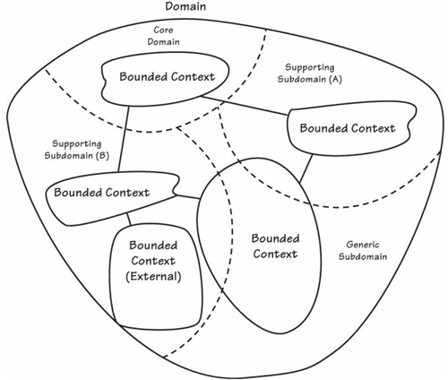

# Bounded Context examples

*updated: 14.04.2024  

An incomplete list of Bounded Context examples as found in the canonical DDD literature.

 
###### Figure from [Vernon 2013] p70

 

| Bounded Context        |Source & Domain object & Remarks                                        |
| :-------------------------------- | :-------------------------------------------------------------------------------------------------------------- |
| Booking          | [Evans 2003] p16 ('Passenger')   [Evans 2003] p370   [Millett 2015] p86                                        |
| Billing   | [Khononov 2022] p91 (with context map)    [Khononov 2022] p238                                       |
| Catalogue   | [Millett 2015] p227   [Khononov 2022] p238                                    |
| CRM | [Millett 2015] p100 (Customer model shared kernel with Bounded Context Commerce)   [Vernon 2013] p190   [Zimarev 2019] p410    [Khononov 2022] p70    [Khononov 2022] p91 (with context map)   [Khononov 2022] p238   [Khononov 2022] p321                   |
| Customer Service    | [Khononov 2022] p76 ('Ticket')   [Fowler 2014](https://martinfowler.com/bliki/BoundedContext.html) ('Product', 'Customer')        |
| HR | [Khononov 2022] p96 (Employee model as shared kernel with Bounded Context Payroll)         |
| Identity & Access    | [Khononov 2022] p91 (with context map)    [Vernon 2013] p74        |

| Tables                           |      Are                                   |  Cool                              |
|----------------------------------|:------------------------------------------:|-----------------------------------:|
| col 1 is                         |  left-aligned                              | $1600                              |
| col 2 is                         |    centered                                |   $12                              |
| col 3 is                         | right-aligned                              |    $1                              |

