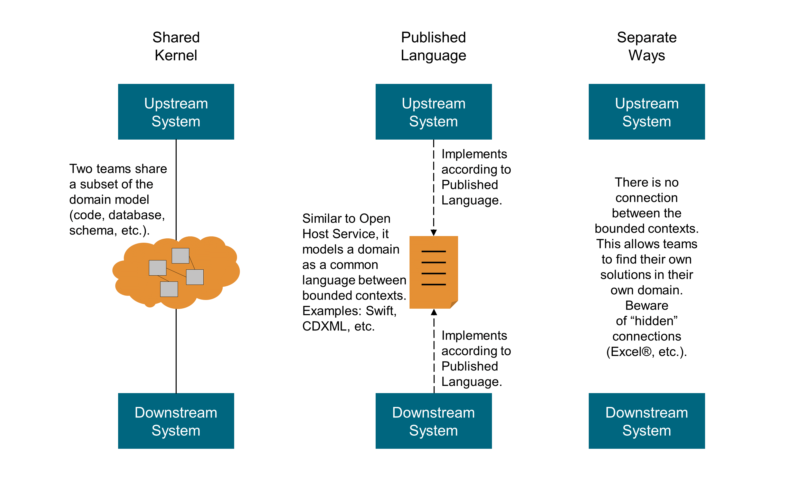

# Great quotes for the concept of Published Language 

Mission of this overview is to bring great quotes for the concept of the Published Language, in order to get a better understandig of this fundamental DDD integration pattern.

> The translation between the models of two bounded contexts requires a common language. Use a well-documented shared language that can express the necessary domain information as a common medium of communication, translating as necessary into and out of that language. Published Language is often combined with Open Host Service. [Evans 2003](https://pubs.opengroup.org/architecture/o-aa-standard/DDD-strategic-patterns.html#_midway_patterns)

*last update: 24.10.2023*

##### [design-practice-repository by Olaf Zimmermann 2023](https://socadk.github.io/design-practice-repository/activities/DPR-StrategicDDD.html)
* Published Language (PL): “The interacting bounded contexts agree on a **common language** (for example a bunch of XML schemas over an enterprise service bus) by which they can interact with each other.”

___

##### [Domain-Driven Design, Definitions and Pattern Summaries by Eric Evans 2015](https://www.domainlanguage.com/wp-content/uploads/2016/05/DDD_Reference_2015-03.pdf)
* Many **industries establish	published	languages	in the form	of data interchange standards**. Project teams also develop their own for use within their organization.

___

##### [Implementing Domain-Driven Design by Vaughn Vernon 2013](https://ptgmedia.pearsoncmg.com/images/9780321834577/samplepages/0321834577.pdf)
* p115:  REST also has the advantage of producing hypermedia representations, which facilitates HATEOAS. Hypermedia makes a Published Language very dynamic and interactive, enabling clients to navigate to sets of linked resources. The Language may be published **using standard and/or custom media types**. 

___

##### [Learning Domain-Driven Design by Vlad Khononov 2021](https://www.amazon.com/Learning-Domain-Driven-Design-Aligning-Architecture/dp/1098100131)
* p88: The supplier’s public interface is not intended to conform to its ubiquitous language. Instead, it is intended to expose a protocol convenient for the consumers, expressed in an **integration-oriented language**. As such, the public protocol is called the published language. 
* p194: Moreover, translating messages to the published language enables differentiating between **private events** that are intended for the bounded context’s internal needs and **public events** that are designed for integration with other bounded contexts. 
* p305 : Introducing the integration-oriented model, the published language, reduces the system’s global complexity. First, it allows us to evolve the service’s implementation without impacting its consumers: the new implementation model can be translated to the existing published language. Second, the published language exposes a more **restrained model**. It is designed around integration needs. It encapsulates the complexity of the implementation that is not relevant to the service’s consumers. For example, it can expose less data and in a more convenient model for consumers. 
* Furthermore, a published language describes **only what is encompassed by its bounded context, and not the whole system, as in the case of a CDM** (https://github.com/vladikk/learning-ddd/issues/2#issuecomment-1054147883)

___

##### [Domain-Driven Design Crew Context Mapping](https://github.com/ddd-crew/context-mapping)
* Widely known examples for a Published Language are **iCalendar or vCard**. Published language is often combined with an open-host service.

___

##### [BPM2DDD: A Systematic Process for Identifying Domains from Business Processes Models](https://www.mdpi.com/2674-113X/1/4/18/htm)
* The Document printing relationship type was defined as open host service and published language, as this is a **generic** context that can be used by any other context inside the organisation.

___

##### [Opus: DDD Concepts and Patterns – Context Map](https://opus.ch/ddd-concepts-and-patterns-context-map/)
* Further development of the open host service may lead to (the use of) a published language that has it’s own bounded context. The language could be a **model defined by some industry association or state** for example.

___

##### [Herberto Graca: DDD.14 – Maintaining model integrity](https://herbertograca.com/2016/02/05/ddd-14-maintaining-model-integrity/)
* Therefore we need a common, standard, communication Interchange Language that any system con use to communicate with our system, we need a published language:
If possible, use an **industry standard language**;

___

##### [Strategic Domain-Driven Design](https://dev.to/peholmst/strategic-domain-driven-design-3e87)
* Real world examples of published languages are **MathML** for representing mathematical formulas and **GML** for representing geographical features in geographical information systems.

___

##### [An Introduction to Domain Driven Design by Dan Haywood](https://www.methodsandtools.com/archive/archive.php?id=97)
* With a published language we start off with the BCs establishing a common standard by which they can interact; neither owns this language, rather it is owned by the enterprise in which they reside (**it might even be an industry standard**).

___

##### [Introduction to Context Mapping by Michael Plöd 2022](https://www.innoq.com/de/talks/2022/06/introduction-to-context-mapping-ddd-europe-2022/)
* Sometimes defined by a **consortium** of the most important stakeholders / teams. Examples: iCalendar, vCard, ZugFerd (slide 59).

___

##### [Microservices love Domain-Driven Design! Why and how? by Michael Plöd 2019](https://youtu.be/E6zhkC58XQ8?t=2687)
* A published language is more than just an interface xsd or OpenAPI descripten: it should be governed by a domain steering committee - it is an industry standard set by a consortium.

___

##### [Microservices love Domain Driven Design? by Michael Plöd 2018](https://youtu.be/1eP7o2YpweA?t=1182)
* A typical example is the ISBN in the book publishing domain.

___

##### [Domain-driven Service Design - Context Modeling, Model Refactoring and Contract Generation by Kapferer/Zimmermann 2020](https://contextmapper.org/media/SummerSoC-2020_Domain-driven-Service-Design_Authors-Copy.pdf)
* A context which offers functionalities to other contexts has to expose some parts of its own domain model. Direct translations and exposing internals of the domain model impose coupling. Industry standards or organization internal specifications establish a well-documented and agreed-upon model subset, a Published Language (PL). This allows providers to guarantee language stability.

___

##### [Interesting discussion on LinkedIn about DDD's Published Language with Vaughn Vernon 2023](https://www.linkedin.com/feed/update/urn:li:activity:7122240900784611328/)
* Avoid consortium....

___
