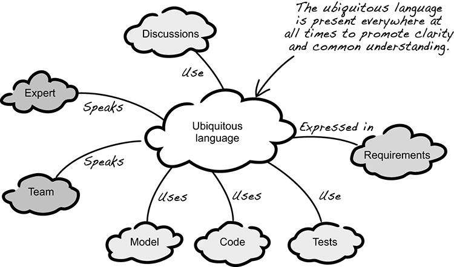

# Great quotes for the concept of Ubiquitous Language 

Mission of this overview is the bring great quotes for the concept of Ubiquitous Language, in order to get a better understandig of this fundamental DDD concept. Bounded context and the ubiquitous language are the foundation of DDD.

> A language structured around the domain model and used by all team members to connect all the activities of the team with the software. [Evans 2003](https://pubs.opengroup.org/architecture/o-aa-standard/DDD-strategic-patterns.html#context-map)

*last update: 10.10.2021*

